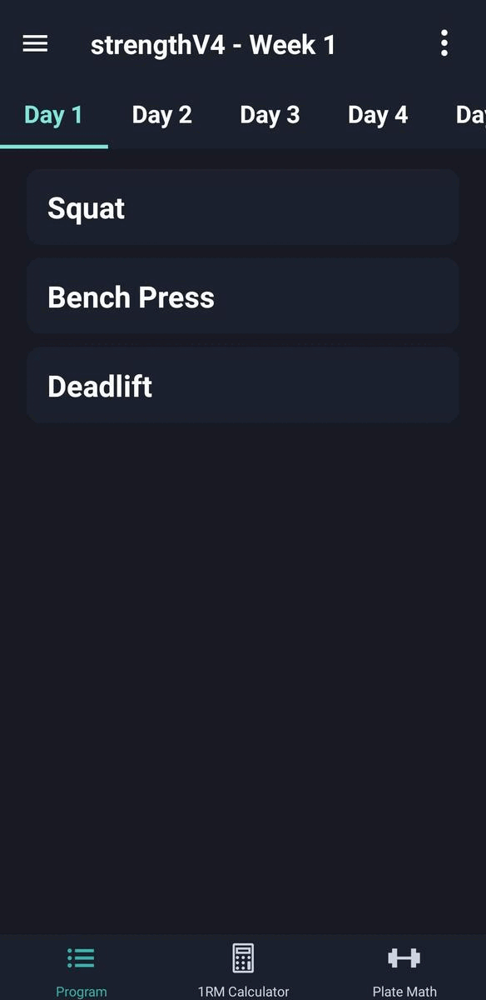

# BarbellWhip

BarbellWhip is a Free and Open Source workout management app made with the
complexity of percentage based powerlifting training programs in mind, aiming to
replace the use of spreadsheets while also providing features such as RM and
plate calculators and a program editor.

Built with React Native, and currently only supported on Android.

## How to run on Android

Using node version `v18.12.1` install the dependencies by running `npm i`.

In one terminal run the command below

`npx react-native start`

And in another terminal run the following commands

`export JAVA_HOME='/usr/lib/jvm/java-11-openjdk/'`

`export ANDROID_SDK_ROOT='/home/$USER/Android/Sdk'`

`npx react-native run-android`

## How to build for Android (debug apk)

Run the command below in the project's root directory

`npx react-native bundle --platform android --dev false --entry-file index.js --bundle-output android/app/src/main/assets/index.android.bundle --assets-dest android/app/src/main/res`

Then run the commands below in the `/android` directory

`export JAVA_HOME='/usr/lib/jvm/java-11-openjdk/'`

`export ANDROID_SDK_ROOT='/home/$USER/Android/Sdk'`

`./gradlew assembleDebug`

## How to run on iOS

Using node version `v18.12.1` install the dependencies by running `npm i`

`cd ios`

`pod install`

`brew install watchman`

`npx react-native run-ios`

or

`npx react-native run-ios --simulator='iPhone 14 Pro (16.0)'`
